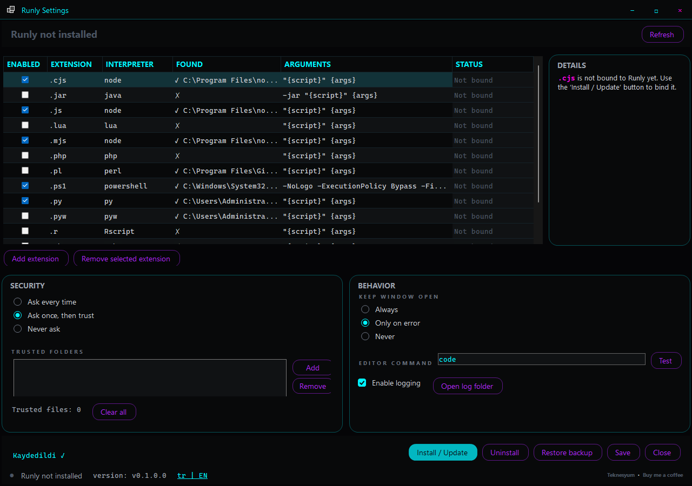

# Runly



Runly turns Windows script files into a double-clickable experience.

Instead of opening `.js`, `.ps1`, `.py`, `.sh`, `.ts`, and related files in an editor, Runly detects the correct interpreter, applies safety checks, and launches the script like a regular Windows application. It also adds a **Run with Runly** context-menu action with optional command-line arguments.

## Install with one PowerShell command

Open PowerShell and run:

```powershell
irm https://raw.githubusercontent.com/Teknesyum/Runly/main/scripts/install.ps1 | iex
```

The installer downloads the latest Windows x64 release, installs Runly to `%LOCALAPPDATA%\Programs\Runly`, creates a **Runly** shortcut on the desktop, and opens Runly Settings. Select the extensions you want and click **Install / Update** to finish the Windows file-association setup.

> Runly does not silently replace Windows file associations. Windows 11 may require your confirmation for individual extensions.

## What Runly does

- Runs scripts by double-clicking them in File Explorer.
- Detects Node.js, PowerShell, Python, Git Bash, and other configured interpreters.
- Supports `.js`, `.cjs`, `.mjs`, `.ts`, `.ps1`, `.py`, `.sh`, and custom extensions.
- Adds a **Run with Runly** context-menu command.
- Accepts optional arguments before launching a script.
- Checks Mark-of-the-Web and trusted-file state before execution.
- Keeps reversible registry backups when changing file associations.
- Provides a graphical settings and uninstall experience.

## Requirements

- Windows 10 or Windows 11, x64.
- The interpreter required by your scripts, such as Node.js or Python.
- PowerShell 5.1 or newer for installation.

Runly is self-contained, but it does not bundle language runtimes. For example, running a Python script still requires Python to be installed.

## Usage

After setup, double-click a supported script or right-click it and choose **Run with Runly**.

Runly can also be used directly:

```powershell
Runly.exe .\hello.js
Runly.exe .\script.ps1
Runly.exe .\tool.py --verbose input.txt
```

The first launch of an untrusted script may show a confirmation dialog. Files downloaded from the internet can carry Mark-of-the-Web and receive stricter treatment.

## Settings and data

Runly is installed here:

```text
%LOCALAPPDATA%\Programs\Runly
```

User configuration, trust data, logs, and registry backups are stored under:

```text
%APPDATA%\Runly
```

## Uninstall

Open the **Runly** desktop shortcut and use the uninstall action in Runly Settings, or run:

```powershell
& "$env:LOCALAPPDATA\Programs\Runly\uninstall.ps1"
```

Runly restores or removes the file-association entries it manages. User configuration is retained unless you choose to remove it.

## Build from source

Requirements: Windows x64 and the .NET 8 SDK with NativeAOT prerequisites.

```powershell
git clone https://github.com/Teknesyum/Runly.git
cd Runly
.\build.ps1
```

The build runs the test suite, publishes the NativeAOT launcher and self-contained settings application, and creates `Runly-v0.1.0-win-x64.zip`.

## Security

Running scripts can modify files, start programs, and access user data. Only run scripts you trust. Runly adds safety checks and explicit prompts, but it cannot make malicious code safe.

Please report security issues privately to the repository owner instead of opening a public exploit report.

## Release

Current version: **v0.1.0**  
Download: [Runly v0.1.0 for Windows x64](https://github.com/Teknesyum/Runly/releases/tag/v0.1.0)

---

## Support

This application is built in spare time and is free.

<a href="https://github.com/sponsors/Teknesyum"></a>

**[github.com/Teknesyum](https://github.com/Teknesyum)** · MIT
