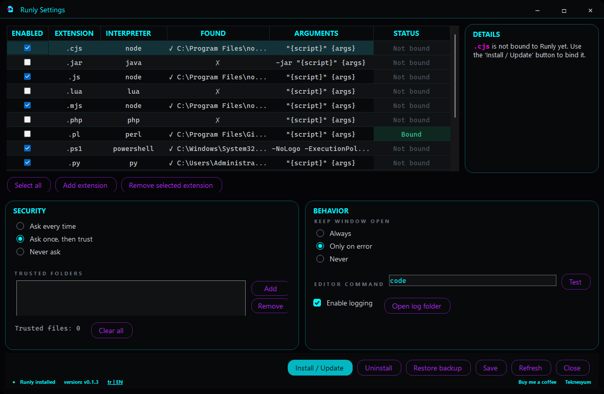
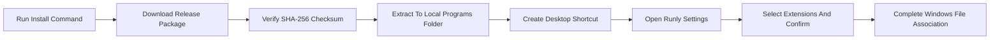
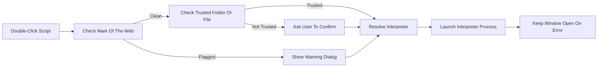
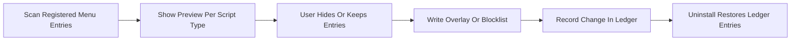
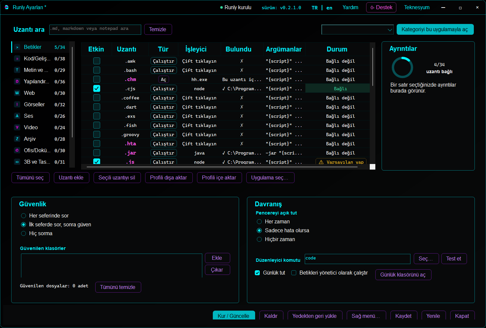
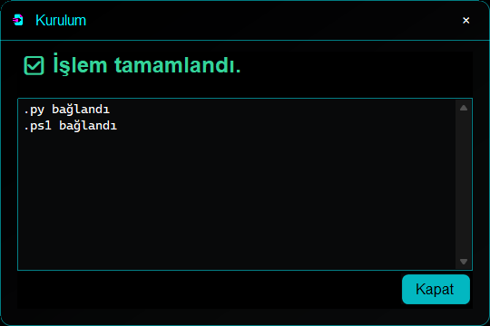
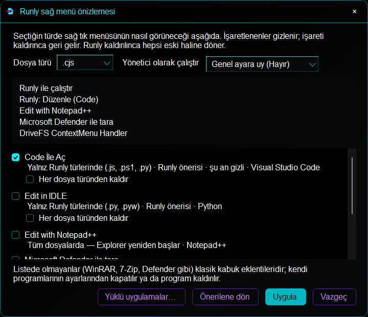
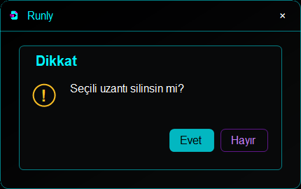

# Runly

[](README.tr.md)



**Run scripts, not accidents.**

## Numbers First

| Metric | Value | Source |
|---|---|---|
| Core test suite | 289 passed / 289 | `dotnet test tests/Runly.Core.Tests`, run 2026-09-27 |
| Application catalog | 412 entries | `src/Runly.Settings/Catalog/catalog.json` |

## What It Is

Runly is a Windows file-association hub for script files. Instead of `.js` opening in WScript
or `.ps1` opening in a text editor, Runly detects the right interpreter and runs the file like
a normal program. It checks Mark-of-the-Web and trust state first, so a downloaded script does
not run silently. Settings, trust data, and registry backups live under the user's own profile,
never system-wide. A single WinForms application manages extensions, the security gate, and the
right-click menu.

## Doesn't Windows Already Do This?

Windows already ships file associations, an Open With dialog, and a right-click menu per file
type. That is the base it builds on.

- Detects an interpreter per script (Node, Python, PowerShell, Git Bash, or a custom one)
  instead of mapping one extension to one fixed program.
- Adds a Mark-of-the-Web and trust check before running, which a plain double-click association
  does not have.
- Keeps the console window open on a non-zero exit code, instead of a window that flashes and
  closes before the error is readable.
- Cleans up right-click entries other installed programs add to Runly's script types, with a
  ledger so Uninstall can put them back.

## Features

- **Interpreter detection.** Reads a script's shebang line first, then the configured extension
  mapping, then reports a missing interpreter instead of guessing.

- **Security gate.** Every run checks Mark-of-the-Web, then a trusted-folder or trusted-file
  match, before falling back to the configured `securityMode`.

- **Context-menu cleanup.** Lists every entry — packaged and classic shell extensions — on a
  script type's right-click menu and lets the user hide the ones that do not belong there.

- **Reversible registry changes.** Every association change is backed up as valid `.reg` text
  before it is written, and Uninstall restores it.

- **Locked-file recovery.** When a script cannot be read because another process holds it, Runly
  asks the Restart Manager who that is and offers to end that process and retry.

- **Settings GUI.** One window lists every mapped extension, whether its interpreter was found,
  and whether Windows has actually bound the file type to Runly.

## What It Doesn't Do

- Does not code-sign its binaries. Windows SmartScreen shows "Unknown publisher" on first run;
  see [Security](#security).
- Does not sandbox scripts. The security gate is a set of checks and prompts, not a way to make
  malicious code safe to run.
- Does not bundle language runtimes. Node, Python, and other interpreters must already be
  installed.
- Does not force a `.ps1` file association. Windows protects `UserChoice` with a hash Runly
  cannot forge, so the user still completes "Open with → Always" by hand.
- Windows only. There is no macOS or Linux build.

## Install with One PowerShell Command

Open PowerShell and run:

```powershell
irm https://raw.githubusercontent.com/Teknesyum/Runly/v0.3.0/scripts/install.ps1 | iex
```

The command points at the `v0.3.0` release tag, not `main`, so an install always matches a
published, checksummed build.

The installer downloads the release's Windows x64 package, verifies it against the `.sha256`
checksum published on the [release page](https://github.com/Teknesyum/Runly/releases), installs
Runly to `%LOCALAPPDATA%\Programs\Runly`, creates a desktop shortcut, and opens Runly Settings.
It shows a window with the five steps, a progress bar and a short log; the install folder can be
changed there before pressing Kur. No administrator rights are needed.

| Option | Effect |
|---|---|
| `-Silent` or `RUNLY_OTOMATIK=1` | No window; progress is written to the console. |
| `-Rehearsal` or `RUNLY_PROVA=1` | Installs into a temporary folder and writes no shortcut. |
| `-InstallPath <folder>` | Installs somewhere other than the default folder. |

Once installed, Runly Settings checks the release page on start. A newer release shows a yellow
"Güncelleme" badge in the title bar: the first click downloads it in the background, the badge
turns green, and the second click installs it and restarts Settings.

Required: Windows 10 or 11 x64, PowerShell 5.1 or newer to run the installer.

Optional: the interpreter your scripts need (Node.js, Python, and so on) — Runly does not
install these for you.

> Runly does not silently replace Windows file associations. Windows 11 may still ask you to
> confirm individual extensions; see the diagram below.

### Install Flow


```mermaid
flowchart LR
    A[Run Install Command] --> B[Download Release Package]
    B --> C[Verify SHA-256 Checksum]
    C --> D[Extract To Local Programs Folder]
    D --> E[Create Desktop Shortcut]
    E --> F[Open Runly Settings]
    F --> G[Select Extensions And Confirm]
    G --> H[Complete Windows File Association]
```

*The installer runs the install command, downloads the release package, verifies its SHA-256
checksum, extracts it to the local Programs folder, creates a desktop shortcut, opens Runly
Settings, lets the user select extensions and confirm, then completes the Windows file
association.*

## How It Works

A double-click or `Runly.exe <script>` call goes through the security gate before anything
runs: Mark-of-the-Web check first (always, regardless of `securityMode`), then a trusted-folder
or trusted-file match, then the configured mode decides whether to ask. Interpreter resolution
checks the file's shebang line before the configured extension mapping. The launcher does not
redirect stdout or stderr, so colors, progress bars, and interactive input behave like a normal
console program; on a non-zero exit code the window stays open and prints the exit code and
duration.

### Run Flow


```mermaid
flowchart LR
    A[Double-Click Script] --> B[Check Mark Of The Web]
    B -->|Flagged| C[Show Warning Dialog]
    B -->|Clean| D[Check Trusted Folder Or File]
    D -->|Trusted| F[Resolve Interpreter]
    D -->|Not Trusted| E[Ask User To Confirm]
    E --> F
    C --> F
    F --> G[Launch Interpreter Process]
    G --> H[Keep Window Open On Error]
```

*Running a script double-clicks it, checks Mark-of-the-Web, shows a warning dialog when flagged
or checks the trusted folder or file when clean, asks the user to confirm when not trusted,
resolves the interpreter, launches the interpreter process, and keeps the window open on error.*

Context-menu cleanup works the same way, one layer up: it scans what is registered against a
script type, lets the user hide entries, and writes the change so Uninstall can reverse it.

### Context-Menu Cleanup Flow


```mermaid
flowchart LR
    A[Scan Registered Menu Entries] --> B[Show Preview Per Script Type]
    B --> C[User Hides Or Keeps Entries]
    C --> D[Write Overlay Or Blocklist]
    D --> E[Record Change In Ledger]
    E --> F[Uninstall Restores Ledger Entries]
```

*Cleaning up a context menu scans registered menu entries, shows a preview per script type, lets
the user hide or keep entries, writes an overlay or blocklist, records the change in a ledger,
and Uninstall restores the ledger entries.*

## The Program Shows What It Does



The settings window: every mapped extension, its interpreter, whether that interpreter was
found, and whether Windows has actually bound the extension to Runly.



The result dialog: a line-by-line list of what an install or uninstall run actually changed.



The context-menu dialog: every entry on a script type's right-click menu, with a toggle to hide
the ones that do not belong there. *(screenshot not yet captured)*



A launcher prompt: the confirmation Runly shows before an action it cannot silently reverse.

## Developer

```powershell
git clone https://github.com/Teknesyum/Runly.git
```

```powershell
cd Runly
.\build.ps1
```

`build.ps1` runs the test suite, publishes the NativeAOT launcher and the self-contained
settings application, and produces `Runly-v<version>-win-x64.zip` with a matching `.sha256`
file. The version comes from `Directory.Build.props`.

```powershell
dotnet test tests/Runly.Core.Tests
```

Requirements: Windows x64 and the .NET 8 SDK with NativeAOT prerequisites.

Layout:

```text
src/
├─ Runly.Core/             # contracts and logic (AOT-safe)
├─ Runly.Launcher/         # launcher logic (class library, AOT-safe)
├─ Runly.Launcher.Gui/     # Runly.exe (AOT, GUI subsystem)
├─ Runly.Launcher.Console/ # RunlyConsole.exe (AOT, console subsystem)
└─ Runly.Settings/         # RunlySettings.exe (WinForms)
tests/
└─ Runly.Core.Tests/       # xUnit, 289 tests
```

`Runly.Core` holds no `Console.WriteLine` and no UI calls — pure, testable logic behind
`IFileSystem` and `IDialogService`. All user-facing text is Turkish; code, identifiers, and
commit messages are English. See [docs/SPEC.md](docs/SPEC.md) for the full technical
specification and [docs/diagram.md](docs/diagram.md) for the diagram set. UI contrast audits
live under `docs/ui-denetim/`.

## Settings and Data

Runly is installed here:

```text
%LOCALAPPDATA%\Programs\Runly
```

User configuration, trust data, logs, and registry backups are stored under:

```text
%APPDATA%\Runly
```

## Uninstall

Open the **Runly** desktop shortcut and use the uninstall action in Runly Settings, or run:

```powershell
& "$env:LOCALAPPDATA\Programs\Runly\uninstall.ps1"
```

Runly restores or removes the file-association entries it manages. User configuration is
retained unless you choose to remove it.

## Security

Running scripts can modify files, start programs, and access user data. Only run scripts you
trust. Runly adds safety checks and explicit prompts, but it cannot make malicious code safe.

Report vulnerabilities privately through
[GitHub private vulnerability reporting](https://github.com/Teknesyum/Runly/security/advisories/new)
instead of opening a public exploit report. See [SECURITY.md](SECURITY.md) for the supported
version and disclosure timeline.

### SmartScreen on First Launch

Runly is not code-signed, so Windows may show **"Windows protected your PC — Unknown
publisher"** the first time you run it. This is expected for an unsigned application and does
not mean the file was altered. Click **More info**, then **Run anyway**.

To confirm the download first, compare its hash against the SHA-256 published on the release
page:

```powershell
Get-FileHash .\Runly-v0.3.0-win-x64.zip -Algorithm SHA256
```

## Contributing

Open an issue before a pull request, so the change is agreed on before the work is. Keep pull
requests small and to one concern.

The repository language is English: code, identifiers, commit messages, and documentation.
Every contribution is licensed under the project's license, AGPL-3.0-or-later — there is no
separate contributor agreement to sign.

This project is unpaid work; sponsoring it does not change how contributions are reviewed.

## License

AGPL-3.0-or-later. See [LICENSE](LICENSE).

---

<div align="center" role="region" aria-label="Support Teknesyum">

<a href="https://github.com/sponsors/Teknesyum"></a>

<a href="https://github.com/sponsors/Teknesyum"></a>
&nbsp;
<a href="LICENSE"></a>

</div>
