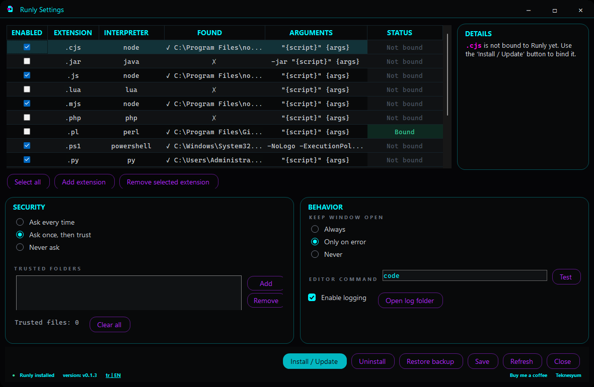

# Runly

[English](README.md) | **Türkçe**



Runly bir Windows dosya ilişkilendirme merkezidir: betikleri güvenle çalıştırır ya da belgeleri açıkça seçilmiş bir uygulamada açar; aranabilir kategoriler ve toplu atama ile.

`.js`, `.ps1`, `.py`, `.sh`, `.ts` ve benzeri dosyaları bir düzenleyicide açmak yerine Runly doğru yorumlayıcıyı bulur, güvenlik denetimlerini uygular ve betiği sıradan bir Windows uygulaması gibi başlatır. Ayrıca isteğe bağlı komut satırı argümanlarıyla birlikte bir **Runly ile çalıştır** sağ tık komutu ekler.

## Tek PowerShell komutuyla kurulum

PowerShell'i açın ve çalıştırın:

```powershell
irm https://raw.githubusercontent.com/Teknesyum/Runly/main/scripts/install.ps1 | iex
```

Kurulum betiği en son Windows x64 sürümünü indirir, Runly'yi `%LOCALAPPDATA%\Programs\Runly` altına kurar, masaüstünde bir **Runly** kısayolu oluşturur ve Runly Ayarları'nı açar. İstediğiniz uzantıları seçip **Kur / Güncelle** düğmesine basınca Windows dosya ilişkilendirmesi tamamlanır.

Arşiv açılmadan önce kurulum betiği, sürümle birlikte yayımlanan `.sha256` sağlama toplamını indirir ve indirilen dosyayı ona karşı doğrular; özetler tutmazsa kurulum durur.

> Runly Windows dosya ilişkilendirmelerini sessizce değiştirmez. Windows 11 tek tek uzantılar için onayınızı isteyebilir.

## Runly ne yapar

- Dosya Gezgini'nde çift tıklayarak betik çalıştırır.
- Node.js, PowerShell, Python, Git Bash ve yapılandırılmış diğer yorumlayıcıları bulur.
- `.js`, `.cjs`, `.mjs`, `.ts`, `.ps1`, `.py`, `.sh` ve özel uzantıları destekler.
- Sağ tık menüsüne **Runly ile çalıştır** komutunu ekler.
- Betiği başlatmadan önce isteğe bağlı argüman alır.
- Çalıştırmadan önce Mark-of-the-Web ve güvenilen dosya durumunu denetler.
- Dosya ilişkilendirmelerini değiştirirken geri alınabilir kayıt defteri yedekleri tutar.
- Grafik arayüzlü bir ayar ve kaldırma deneyimi sunar.

## Gereksinimler

- Windows 10 veya Windows 11, x64.
- Betiklerinizin gerektirdiği yorumlayıcı — örneğin Node.js ya da Python.
- Kurulum için PowerShell 5.1 veya üstü.

Runly kendi kendine yeter, ama dil çalışma zamanlarını paketlemez. Örneğin bir Python betiğini çalıştırmak yine de Python'un kurulu olmasını gerektirir.

## Kullanım

Kurulumdan sonra desteklenen bir betiğe çift tıklayın ya da sağ tıklayıp **Runly ile çalıştır** deyin.

Runly doğrudan da kullanılabilir:

```powershell
Runly.exe .\hello.js
Runly.exe .\script.ps1
Runly.exe .\tool.py --verbose input.txt
```

Güvenilmeyen bir betiğin ilk çalıştırılışında onay penceresi çıkabilir. İnternetten indirilen dosyalar Mark-of-the-Web taşıyabilir ve daha sıkı işlem görür.

## Ayarlar ve veriler

Runly şuraya kurulur:

```text
%LOCALAPPDATA%\Programs\Runly
```

Kullanıcı yapılandırması, güven verileri, günlükler ve kayıt defteri yedekleri şurada tutulur:

```text
%APPDATA%\Runly
```

## Kaldırma

Masaüstündeki **Runly** kısayolunu açıp Runly Ayarları'ndaki kaldırma eylemini kullanın ya da şunu çalıştırın:

```powershell
& "$env:LOCALAPPDATA\Programs\Runly\uninstall.ps1"
```

Runly yönettiği dosya ilişkilendirme kayıtlarını geri yükler ya da siler. Kullanıcı yapılandırması, siz silmeyi seçmedikçe korunur.

## Kaynaktan derleme

Gereksinimler: Windows x64 ve NativeAOT ön koşullarıyla birlikte .NET 8 SDK.

```powershell
git clone https://github.com/Teknesyum/Runly.git
cd Runly
.\build.ps1
```

Derleme test takımını çalıştırır, NativeAOT başlatıcıyı ve kendi kendine yeten ayar uygulamasını yayımlar, `Runly-v<sürüm>-win-x64.zip` dosyasını ve yanında bir `Runly-v<sürüm>-win-x64.zip.sha256` sağlama dosyasını üretir. Sürüm `Directory.Build.props` dosyasından gelir, böylece arşiv adı içindeki ikili dosyalarla her zaman aynı olur.

## Güvenlik

Betik çalıştırmak dosyaları değiştirebilir, program başlatabilir ve kullanıcı verisine erişebilir. Yalnızca güvendiğiniz betikleri çalıştırın. Runly güvenlik denetimleri ve açık onaylar ekler, ama kötü niyetli kodu güvenli hâle getiremez.

Güvenlik açıklarını herkese açık bir istismar raporu açmak yerine depo sahibine özel olarak bildirin.

### İlk açılışta SmartScreen

Runly kod imzalı değildir, bu yüzden Windows ilk çalıştırmada **"Windows bilgisayarınızı korudu — Bilinmeyen yayımcı"** uyarısını gösterebilir. İmzasız bir uygulama için bu beklenen bir durumdur ve dosyanın değiştirildiği anlamına gelmez. Devam etmek için **Ek bilgi**, sonra **Yine de çalıştır** deyin.

İndirmeyi önce doğrulamak isterseniz özetini sürüm sayfasında yayımlanan SHA-256 ile karşılaştırın:

```powershell
Get-FileHash .\Runly-v0.2.0-win-x64.zip -Algorithm SHA256
```

## Sürüm

Şu anki kaynak sürümü: **v0.2.0**

---

## Lisans

AGPL-3.0-or-later — bkz. [LICENSE](LICENSE).

Copyright (C) 2026 Teknesyum

---

## Destek

Bu uygulama boş zamanlarda yazılıyor ve ücretsiz.

<a href="https://github.com/sponsors/Teknesyum"></a>

**[github.com/Teknesyum](https://github.com/Teknesyum)** · [AGPL-3.0-or-later](LICENSE)
