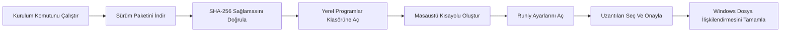
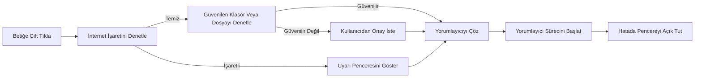
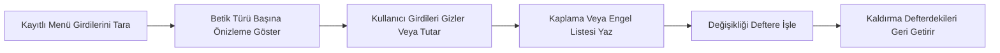

# Runly

[](README.md)


**Kaza değil, betik çalıştırır.**

## Önce Sayılar

| Ölçüm | Değer | Kaynak |
|---|---|---|
| Core test takımı | 289 geçti / 289 | `dotnet test tests/Runly.Core.Tests`, 2026-09-27'de çalıştırıldı |
| Uygulama kataloğu | 412 kayıt | `src/Runly.Settings/Catalog/catalog.json` |

## Nedir

Runly, betik dosyaları için bir Windows dosya ilişkilendirme merkezidir. `.js` WScript'te ya da
`.ps1` bir metin düzenleyicide açılmak yerine, Runly doğru yorumlayıcıyı bulur ve dosyayı
sıradan bir program gibi çalıştırır. Önce Mark-of-the-Web ve güven durumunu denetler, böylece
indirilen bir betik sessizce çalışmaz. Ayarlar, güven verisi ve kayıt defteri yedekleri
kullanıcının kendi profilinde durur, sistem genelinde değil. Tek bir WinForms uygulaması
uzantıları, güvenlik kapısını ve sağ tık menüsünü yönetir.

## Bunu Windows Zaten Yapmıyor Mu?

Windows zaten dosya ilişkilendirmesi, bir Birlikte Aç penceresi ve dosya türü başına bir sağ
tık menüsü sunuyor. Runly bunun üzerine kuruluyor.

- Her betik için bir yorumlayıcı bulur (Node, Python, PowerShell, Git Bash ya da özel biri);
  bir uzantıyı tek bir sabit programa bağlamak yerine.
- Çalıştırmadan önce Mark-of-the-Web ve güven denetimi ekler; düz bir çift-tık
  ilişkilendirmesinde bu yoktur.
- Sıfırdan farklı bir çıkış kodunda konsol penceresini açık tutar; hata okunmadan yanıp sönüp
  kapanan bir pencere yerine.
- Diğer kurulu programların Runly'nin betik türlerine eklediği sağ tık girdilerini temizler;
  bir defter sayesinde Kaldırma bunları geri koyabilir.

## Özellikler

- **Yorumlayıcı bulma.** Önce betiğin shebang satırını okur, sonra yapılandırılmış uzantı
  eşlemesine bakar, yorumlayıcı yoksa tahmin etmez, bunu bildirir.

- **Güvenlik kapısı.** Her çalıştırma önce Mark-of-the-Web'i, sonra güvenilen klasör ya da
  dosya eşleşmesini denetler, en son yapılandırılmış `securityMode`'a düşer.

- **Sağ menü temizliği.** Bir betik türünün sağ tık menüsündeki her girdiyi — paketli ve klasik
  shell uzantıları dahil — listeler ve kullanıcının oraya ait olmayanları gizlemesini sağlar.

- **Geri alınabilir kayıt defteri değişiklikleri.** Her ilişkilendirme değişikliği yazılmadan
  önce geçerli `.reg` metni olarak yedeklenir, Kaldırma bunu geri yükler.

- **Kilitli dosya kurtarma.** Bir betik başka bir süreç tarafından tutulduğu için okunamadığında
  Runly Restart Manager'a kimin tuttuğunu sorar ve o süreci sonlandırıp yeniden denemeyi önerir.

- **Ayarlar arayüzü.** Tek bir pencere eşlenmiş her uzantıyı, yorumlayıcısının bulunup
  bulunmadığını ve Windows'un uzantıyı gerçekten Runly'ye bağlayıp bağlamadığını listeler.

## Yapmadıkları

- İkili dosyalarını kod imzalamaz. Windows SmartScreen ilk çalıştırmada "Bilinmeyen yayımcı"
  uyarısı gösterir; bkz. [Güvenlik](#güvenlik).
- Betikleri kum havuzuna almaz. Güvenlik kapısı bir denetim ve onay kümesidir, kötü niyetli
  kodu güvenli hale getirme yöntemi değildir.
- Dil çalışma zamanlarını paketlemez. Node, Python ve diğer yorumlayıcıların zaten kurulu
  olması gerekir.
- `.ps1` dosya ilişkilendirmesini zorlamaz. Windows `UserChoice`'ı Runly'nin sahtesini
  üretemeyeceği bir hash ile korur, bu yüzden kullanıcı "Birlikte aç → Her zaman" adımını yine
  elle tamamlar.
- Yalnızca Windows. macOS ya da Linux sürümü yoktur.

## Tek PowerShell Komutuyla Kurulum

PowerShell'i açın ve çalıştırın:

```powershell
irm https://raw.githubusercontent.com/Teknesyum/Runly/v0.3.0/scripts/install.ps1 | iex
```

Komut `main` yerine `v0.3.0` sürüm etiketini gösterir, böylece kurulum her zaman yayımlanmış ve
sağlaması alınmış bir yapıyla eşleşir.

Kurulum betiği sürümün Windows x64 paketini indirir, bunu
[sürüm sayfasında](https://github.com/Teknesyum/Runly/releases) yayımlanan `.sha256` sağlaması
ile doğrular, Runly'yi `%LOCALAPPDATA%\Programs\Runly` altına kurar, bir masaüstü kısayolu
oluşturur ve Runly Ayarları'nı açar. Beş adımı, ilerleme çubuğunu ve kısa bir günlüğü gösteren
bir pencere açılır; Kur'a basmadan önce kurulum klasörü buradan değiştirilebilir. Yönetici izni
gerekmez.

| Seçenek | Etkisi |
|---|---|
| `-Silent` ya da `RUNLY_OTOMATIK=1` | Pencere açılmaz; ilerleme konsola yazılır. |
| `-Rehearsal` ya da `RUNLY_PROVA=1` | Geçici bir klasöre kurar, kısayol yazmaz. |
| `-InstallPath <klasör>` | Varsayılan klasör yerine başka bir yere kurar. |

Kurulduktan sonra Runly Ayarları açılışta sürüm sayfasına bakar. Yeni bir sürüm varsa başlık
çubuğunda sarı "Güncelleme" rozeti çıkar: ilk tıklama arka planda indirir, rozet yeşile döner,
ikinci tıklama kurar ve Ayarlar'ı yeniden başlatır.

Zorunlu: Windows 10 ya da 11 x64, kurulum betiğini çalıştırmak için PowerShell 5.1 ya da üstü.

İsteğe bağlı: betiklerinizin gerektirdiği yorumlayıcı (Node.js, Python vb.) — Runly bunları
sizin için kurmaz.

> Runly Windows dosya ilişkilendirmelerini sessizce değiştirmez. Windows 11 tek tek uzantılar
> için onayınızı isteyebilir; aşağıdaki diyagrama bakın.

### Kurulum Akışı


```mermaid
flowchart LR
    A[Kurulum Komutunu Çalıştır] --> B[Sürüm Paketini İndir]
    B --> C[SHA-256 Sağlamasını Doğrula]
    C --> D[Yerel Programlar Klasörüne Aç]
    D --> E[Masaüstü Kısayolu Oluştur]
    E --> F[Runly Ayarlarını Aç]
    F --> G[Uzantıları Seç Ve Onayla]
    G --> H[Windows Dosya İlişkilendirmesini Tamamla]
```

*Kurulum betiği kurulum komutunu çalıştırır, sürüm paketini indirir, SHA-256 sağlamasını
doğrular, paketi yerel Programlar klasörüne açar, masaüstü kısayolu oluşturur, Runly
Ayarları'nı açar, kullanıcının uzantıları seçip onaylamasını sağlar, sonra Windows dosya
ilişkilendirmesini tamamlar.*

## Nasıl Çalışır

Bir çift tık ya da `Runly.exe <betik>` çağrısı, herhangi bir şey çalışmadan önce güvenlik
kapısından geçer: önce Mark-of-the-Web denetimi (her zaman, `securityMode` ne olursa olsun),
sonra güvenilen klasör ya da dosya eşleşmesi, en sonda yapılandırılmış mod sormaya karar verir.
Yorumlayıcı çözümü dosyanın shebang satırına, yapılandırılmış uzantı eşlemesinden önce bakar.
Başlatıcı stdout/stderr'i yeniden yönlendirmez, böylece renkler, ilerleme çubukları ve
etkileşimli girdi sıradan bir konsol programı gibi çalışır; sıfırdan farklı bir çıkış kodunda
pencere açık kalır ve çıkış kodunu, süreyi yazar.

### Çalıştırma Akışı


```mermaid
flowchart LR
    A[Betiğe Çift Tıkla] --> B[İnternet İşaretini Denetle]
    B -->|İşaretli| C[Uyarı Penceresini Göster]
    B -->|Temiz| D[Güvenilen Klasör Veya Dosyayı Denetle]
    D -->|Güvenilir| F[Yorumlayıcıyı Çöz]
    D -->|Güvenilir Değil| E[Kullanıcıdan Onay İste]
    E --> F
    C --> F
    F --> G[Yorumlayıcı Sürecini Başlat]
    G --> H[Hatada Pencereyi Açık Tut]
```

*Bir betiği çalıştırmak ona çift tıklar, İnternet İşaretini denetler, işaretliyse uyarı
penceresini gösterir ya da temizse güvenilen klasör veya dosyayı denetler, güvenilir değilse
kullanıcıdan onay ister, yorumlayıcıyı çözer, yorumlayıcı sürecini başlatır ve hatada pencereyi
açık tutar.*

Sağ menü temizliği aynı şekilde, bir katman yukarıda çalışır: bir betik türüne karşı neyin
kayıtlı olduğunu tarar, kullanıcının girdileri gizlemesini sağlar ve değişikliği Kaldırma geri
alabilsin diye yazar.

### Sağ Menü Temizliği Akışı


```mermaid
flowchart LR
    A[Kayıtlı Menü Girdilerini Tara] --> B[Betik Türü Başına Önizleme Göster]
    B --> C[Kullanıcı Girdileri Gizler Veya Tutar]
    C --> D[Kaplama Veya Engel Listesi Yaz]
    D --> E[Değişikliği Deftere İşle]
    E --> F[Kaldırma Defterdekileri Geri Getirir]
```

*Bir sağ tık menüsünü temizlemek kayıtlı menü girdilerini tarar, betik türü başına bir önizleme
gösterir, kullanıcının girdileri gizlemesini ya da tutmasını sağlar, bir kaplama ya da engel
listesi yazar, değişikliği bir deftere işler ve Kaldırma defterdekileri geri getirir.*

## Program Ne Yaptığını Gösterir


Ayarlar penceresi: eşlenmiş her uzantı, yorumlayıcısı, o yorumlayıcının bulunup bulunmadığı ve
Windows'un uzantıyı gerçekten Runly'ye bağlayıp bağlamadığı.


Sonuç diyaloğu: bir kurulum ya da kaldırma çalıştırmasının gerçekte ne değiştirdiğinin satır
satır listesi.


Sağ menü diyaloğu: bir betik türünün sağ tık menüsündeki her girdi, oraya ait olmayanları
gizlemek için bir anahtarla birlikte. *(ekran görüntüsü henüz alınmadı)*


Bir başlatıcı uyarısı: Runly'nin sessizce geri alamayacağı bir eylemden önce gösterdiği onay.

## Geliştirici

```powershell
git clone https://github.com/Teknesyum/Runly.git
```

```powershell
cd Runly
.\build.ps1
```

`build.ps1` test takımını çalıştırır, NativeAOT başlatıcıyı ve kendi kendine yeten ayar
uygulamasını yayımlar, `Runly-v<sürüm>-win-x64.zip` dosyasını ve yanında `.sha256` dosyasını
üretir. Sürüm `Directory.Build.props` dosyasından gelir.

```powershell
dotnet test tests/Runly.Core.Tests
```

Gereksinimler: Windows x64 ve NativeAOT ön koşullarıyla birlikte .NET 8 SDK.

Düzen:

```text
src/
├─ Runly.Core/             # sözleşmeler ve mantık (AOT-uyumlu)
├─ Runly.Launcher/         # başlatıcı mantığı (sınıf kitaplığı, AOT-uyumlu)
├─ Runly.Launcher.Gui/     # Runly.exe (AOT, GUI altsistemi)
├─ Runly.Launcher.Console/ # RunlyConsole.exe (AOT, konsol altsistemi)
└─ Runly.Settings/         # RunlySettings.exe (WinForms)
tests/
└─ Runly.Core.Tests/       # xUnit, 289 test
```

`Runly.Core`'da hiçbir `Console.WriteLine` ve hiçbir UI çağrısı yoktur — saf, test edilebilir
mantık, `IFileSystem` ve `IDialogService` arayüzlerinin arkasında. Kullanıcıya görünen tüm
metinler Türkçe'dir; kod, tanımlayıcılar ve commit mesajları İngilizce'dir. Tam teknik şartname
için [docs/SPEC.md](docs/SPEC.md) dosyasına, diyagram seti için
[docs/diagram.md](docs/diagram.md) dosyasına bakın. Arayüz kontrast denetimleri
`docs/ui-denetim/` altında durur.

## Ayarlar ve Veriler

Runly şuraya kurulur:

```text
%LOCALAPPDATA%\Programs\Runly
```

Kullanıcı yapılandırması, güven verileri, günlükler ve kayıt defteri yedekleri şurada tutulur:

```text
%APPDATA%\Runly
```

## Kaldırma

Masaüstündeki **Runly** kısayolunu açıp Runly Ayarları'ndaki kaldırma eylemini kullanın ya da
şunu çalıştırın:

```powershell
& "$env:LOCALAPPDATA\Programs\Runly\uninstall.ps1"
```

Runly yönettiği dosya ilişkilendirme kayıtlarını geri yükler ya da siler. Kullanıcı
yapılandırması, siz silmeyi seçmedikçe korunur.

## Güvenlik

Betik çalıştırmak dosyaları değiştirebilir, program başlatabilir ve kullanıcı verisine
erişebilir. Yalnızca güvendiğiniz betikleri çalıştırın. Runly güvenlik denetimleri ve açık
onaylar ekler, ama kötü niyetli kodu güvenli hale getiremez.

Güvenlik açıklarını herkese açık bir istismar raporu açmak yerine
[GitHub özel güvenlik açığı bildirimi](https://github.com/Teknesyum/Runly/security/advisories/new)
üzerinden özel olarak bildirin. Desteklenen sürüm ve açıklama takvimi için
[SECURITY.md](SECURITY.md) dosyasına bakın.

### İlk Açılışta SmartScreen

Runly kod imzalı değildir, bu yüzden Windows ilk çalıştırmada **"Windows bilgisayarınızı
korudu — Bilinmeyen yayımcı"** uyarısını gösterebilir. İmzasız bir uygulama için bu beklenen
bir durumdur ve dosyanın değiştirildiği anlamına gelmez. **Ek bilgi**'ye, sonra **Yine de
çalıştır**'a tıklayın.

İndirmeyi önce doğrulamak isterseniz özetini sürüm sayfasında yayımlanan SHA-256 ile
karşılaştırın:

```powershell
Get-FileHash .\Runly-v0.3.0-win-x64.zip -Algorithm SHA256
```

## Katkı

Pull request açmadan önce bir issue açın, böylece değişiklik yapılmadan önce üzerinde
anlaşılır. Pull request'leri küçük ve tek konuya odaklı tutun.

Depo dili İngilizce'dir: kod, tanımlayıcılar, commit mesajları ve belgeler. Her katkı projenin
lisansı olan AGPL-3.0-or-later altında lisanslanır — imzalanacak ayrı bir katkıcı sözleşmesi
yoktur.

Bu proje ücretsiz emekle yapılır; sponsor olmak katkıların nasıl incelendiğini değiştirmez.

## Lisans

AGPL-3.0-or-later. Bkz. [LICENSE](LICENSE).

---

<div align="center" role="region" aria-label="Support Teknesyum">

<a href="https://github.com/sponsors/Teknesyum"></a>

<a href="https://github.com/sponsors/Teknesyum"></a>
&nbsp;
<a href="LICENSE"></a>

</div>
